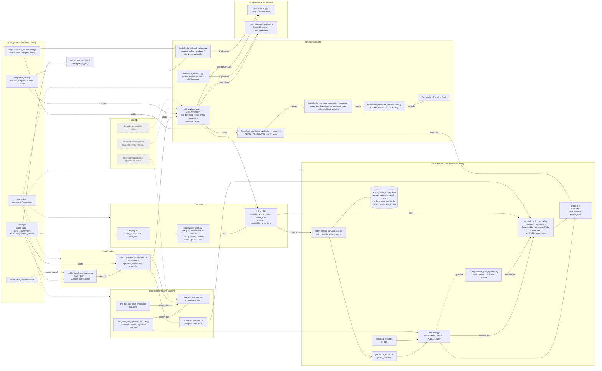
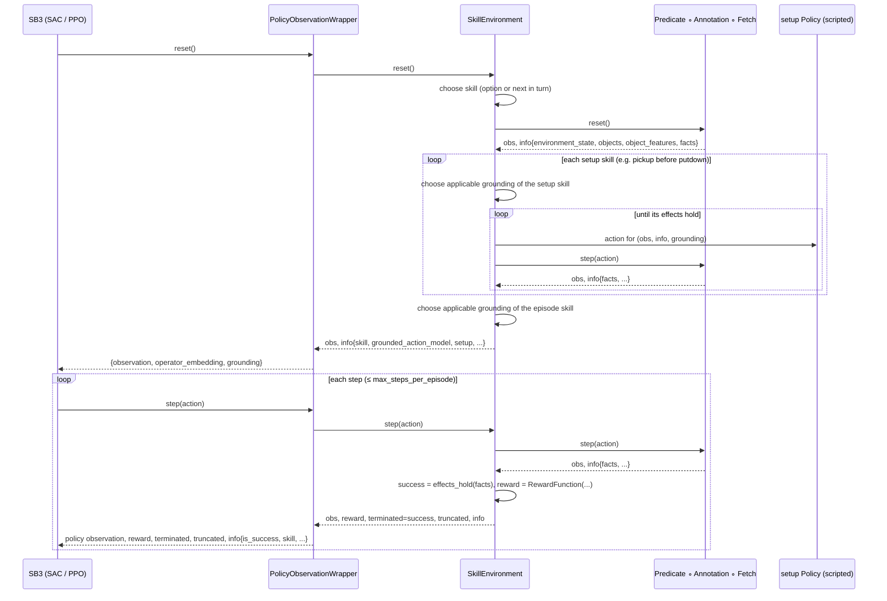

# Component diagrams

Three views of the code as implemented: the component map (packages, entry
points, and how they connect), the data flow of one training episode, and a
class diagram. Solid boxes are implemented; dashed grey boxes are planned.
Arrows point from a component to what it uses, wraps or produces.
`docs/component_diagrams.html` renders the same diagrams in a browser.

## Component map

## One training episode

## Class diagram

Classes and modules as implemented, grouped by package (see `%%` comments).

```mermaid
classDiagram
    direction TB

    %% ---- domain ----
    class Predicate {
        +name: str
        +args: tuple~str~
    }
    class TypedParameter {
        +name: str
        +type: str
    }
    class SymbolicActionModel {
        <<abstract>>
        +name: str
        +parameters: tuple~TypedParameter~
        +ground(binding) GroundedSymbolicActionModel*
    }
    class GroundedSymbolicActionModel {
        <<abstract>>
        +arguments: tuple~str~
        +lifted_model: SymbolicActionModel
        +preconditions_hold(facts) bool*
        +effects_hold(facts) bool*
    }
    class symbolic_action_model {
        <<module>>
        +groundings(model, objects) list
        +applicable_groundings(model, facts, objects) list
    }
    class loader {
        <<module>>
        +SYMBOLIC_ACTION_MODEL_FORMATS: dict
        +load_symbolic_action_model(skill_name, format) SymbolicActionModel
    }

    %% ---- domain.pddl ----
    class PDDLOperator {
        +preconditions: tuple~Precondition~
        +effects: tuple~Effect~
        +ground(binding) GroundedPDDLOperator
    }
    class GroundedPDDLOperator {
        +operator: PDDLOperator
        +arguments: tuple~str~
        +preconditions_hold(facts) bool
        +effects_hold(facts) bool
    }
    class Precondition {
        +predicate: Predicate
        +negated: bool
    }
    class Effect {
        +predicate: Predicate
        +delete: bool
    }
    class pddl_parser {
        <<module>>
        +parse_operator(text) PDDLOperator
    }
    class pddl_writer {
        <<module>>
        +to_pddl(operator) str
    }

    %% ---- skills ----
    class Skill {
        <<abstract>>
        +name() str*
        +setup_skills: tuple~str~
        +symbolic_action_model: SymbolicActionModel
        +ground(binding) GroundedSymbolicActionModel
        +applicable_groundings(facts, objects) list
    }
    class PickupSkill
    class PutdownSkill {
        +setup_skills = pickup
    }
    class registry {
        <<module>>
        +SKILL_REGISTRY: dict
        +build_skill(skill_name, config) Skill
    }

    %% ---- policies, rewards ----
    class Policy {
        <<abstract>>
        +reset()
        +__call__(obs, info, grounded) ndarray*
    }
    class RandomPolicy
    class RewardFunction {
        <<abstract>>
        +reset(grounded, info)
        +__call__(grounded, action, info, success) tuple*
    }
    class SparseReward

    %% ---- environments ----
    class GymWrapper {
        <<external>>
    }
    class MujocoFetchEnv {
        <<external>>
    }
    class FetchMultiBlockEnv {
        +num_blocks: int
    }
    class FetchState {
        +gripper_position: ndarray
        +finger_width: float
        +block_positions: dict
    }
    class FetchEnvStateAnnotationWrapper {
        +num_blocks: int
        +extract_state(obs) FetchState
    }
    class FetchPredicateEvaluationWrapper {
        +evaluate(state) frozenset~Predicate~
    }
    class fetch_predicates {
        <<module>>
        +FETCH_PREDICATES: dict
        +FETCH_PREDICATE_ARITIES: dict
    }
    class SkillEnvironment {
        +skills: dict
        +setup_policies: dict
        +reward_functions: dict
        +grounded_action_model: GroundedSymbolicActionModel
        +reset(seed, options) tuple
        +step(action) tuple
    }
    class FetchScriptedPickupPolicy
    class FetchScriptedPutdownPolicy
    class FetchPickupReward {
        +config: FetchPickupRewardConfig
    }

    %% ---- representations ----
    class OperatorEncoder {
        <<abstract>>
        +dim() int*
        +encode(model) ndarray*
    }
    class PDDLMultiHotOperatorEncoder {
        +features: list
        +max_arity: int
    }
    class OneHotOperatorEncoder
    class GroundingEncoder {
        +max_arity: int
        +max_objects: int
        +encode(grounded, objects, object_features) ndarray
    }

    %% ---- training ----
    class PolicyObservationWrapper {
        +operator_encoder: OperatorEncoder
        +grounding_encoder: GroundingEncoder
    }
    class stable_baselines3_trainer {
        <<module>>
        +train_stable_baselines3(env, algorithm, total_timesteps, run_directory) model
    }
    class SuccessRateCallback

    %% inheritance
    SymbolicActionModel <|-- PDDLOperator
    GroundedSymbolicActionModel <|-- GroundedPDDLOperator
    Skill <|-- PickupSkill
    Skill <|-- PutdownSkill
    Policy <|-- RandomPolicy
    Policy <|-- FetchScriptedPickupPolicy
    Policy <|-- FetchScriptedPutdownPolicy
    RewardFunction <|-- SparseReward
    RewardFunction <|-- FetchPickupReward
    MujocoFetchEnv <|-- FetchMultiBlockEnv
    GymWrapper <|-- FetchEnvStateAnnotationWrapper
    GymWrapper <|-- FetchPredicateEvaluationWrapper
    GymWrapper <|-- SkillEnvironment
    GymWrapper <|-- PolicyObservationWrapper
    OperatorEncoder <|-- PDDLMultiHotOperatorEncoder
    OperatorEncoder <|-- OneHotOperatorEncoder

    %% composition / aggregation
    SymbolicActionModel *-- TypedParameter
    PDDLOperator *-- Precondition
    PDDLOperator *-- Effect
    Precondition *-- Predicate
    Effect *-- Predicate
    GroundedPDDLOperator o-- PDDLOperator
    Skill o-- SymbolicActionModel
    SkillEnvironment o-- Skill
    SkillEnvironment o-- Policy : setup
    SkillEnvironment o-- RewardFunction
    SkillEnvironment o-- GroundedSymbolicActionModel : episode
    FetchPredicateEvaluationWrapper o-- FetchEnvStateAnnotationWrapper : wraps
    SkillEnvironment o-- FetchPredicateEvaluationWrapper : wraps
    PolicyObservationWrapper o-- SkillEnvironment : wraps
    PolicyObservationWrapper o-- OperatorEncoder
    PolicyObservationWrapper o-- GroundingEncoder

    %% dependencies
    SymbolicActionModel ..> GroundedSymbolicActionModel : ground()
    symbolic_action_model ..> SymbolicActionModel
    loader ..> pddl_parser
    pddl_parser ..> PDDLOperator : creates
    pddl_writer ..> PDDLOperator : reads
    Skill ..> loader
    Skill ..> symbolic_action_model
    registry ..> PickupSkill
    registry ..> PutdownSkill
    FetchEnvStateAnnotationWrapper ..> FetchState : creates
    FetchPredicateEvaluationWrapper ..> fetch_predicates
    FetchPredicateEvaluationWrapper ..> Predicate : creates
    PDDLMultiHotOperatorEncoder ..> PDDLOperator : encodes
    GroundingEncoder ..> GroundedSymbolicActionModel : encodes
    stable_baselines3_trainer ..> PolicyObservationWrapper : trains on
    stable_baselines3_trainer ..> SuccessRateCallback
```

`<<abstract>>` marks interfaces, `<<module>>` groups module-level functions and
constants, `<<external>>` marks library classes. Methods ending in `*` are abstract.

