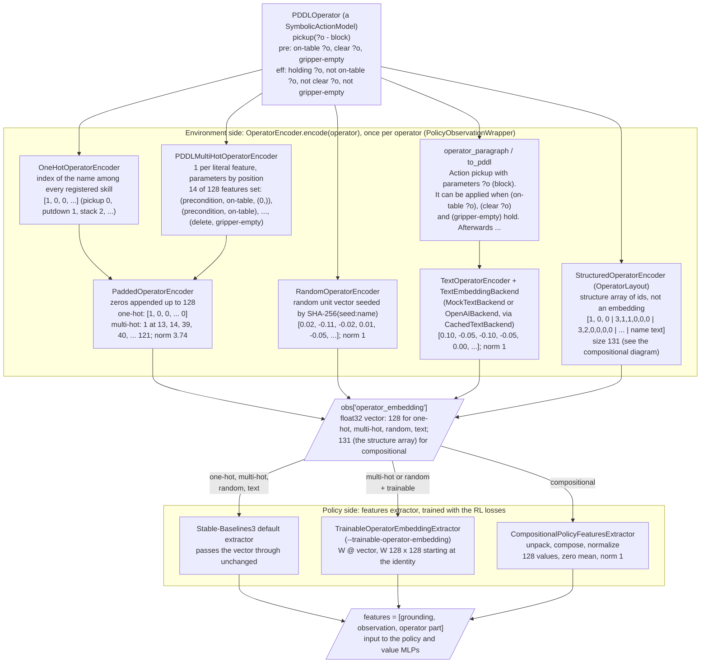
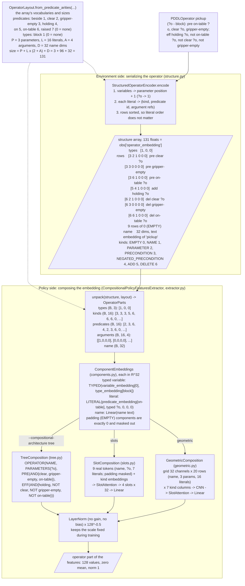

# Operator embeddings

How a PDDL operator becomes `obs["operator_embedding"]`, and how the policy turns that into the operator
part of its features, for every `--operator-encoder`. Each box names a class and shows its output for
the pickup operator below, computed with the default settings (`--operator-embedding-dim 128`,
`--max-operator-arity 3`, `--max-operator-literals 16`, `--max-predicate-arity 4`,
`--component-embedding-dim 32`, `--seed 0`). See `docs/policy_inputs.md` for the full observation.

```lisp
(:action pickup
    :parameters (?o - block)
    :precondition (and (on-table ?o) (clear ?o) (gripper-empty))
    :effect (and (holding ?o) (not (on-table ?o)) (not (clear ?o)) (not (gripper-empty))))
```

Two places do the work. In the environment, `PolicyObservationWrapper` calls an `OperatorEncoder` once
per operator and puts the result in the observation. In the policy, the features extractor (its first
module) turns that observation entry into the operator part of the MLP input. Only the extractor has
trainable parameters, so only that half changes during training.

## Overview: every encoder



What each condition gives the policy:

| condition | structure in the vector | learned | new or repaired operator |
| --- | --- | --- | --- |
| one-hot | none: an index | no | an index no training has used (or, with `--operator-identity-aliases`, the original's) |
| random | none: an identifier | no | its own vector (by name, so a repair keeps it) |
| random + trainable | none | a vector per operator (through W) | a new random vector, not trained |
| text | whatever the text model captures | no | a new text embedding |
| multi-hot | literal features, by parameter position | no | same feature space, new vector |
| multi-hot + trainable | literal features | a vector per feature (columns of W) | the sum of its features' vectors |
| compositional | the full operator, as a tree / tokens / grid | every component and composition function | composed from the same components |

## Compositional: from operator to embedding

The compositional condition splits the work differently. The observation holds the operator's
structure (`StructuredOperatorEncoder`), and the embedding is composed from it inside the policy
(`CompositionalPolicyFeaturesExtractor`). Code: `src/cam/representations/compositional/`.



Notes on the parts that are easy to misread:

- **The structure array is not an embedding.** It is a lossless, fixed-size serialization of the
  operator: integer ids stored as floats, plus the name's fixed text embedding. It sits in
  `obs["operator_embedding"]` only because that is where every condition puts its operator input.
  The actual embedding exists only inside the policy.
- **Ids start at 1; 0 means "nothing".** Predicate and type ids are their vocabulary index + 1,
  argument refs are parameter position + 1, and the kind `EMPTY = 0` marks unused rows. That is why
  `?o` is 1 in the array but `variable_embedding[0]` in the policy.
- **Variables are positions.** `?o` and `?x` in the same position give the same array, and argument
  ref `i` matches grounding slot `i` in `obs["grounding"]`.
- **`OperatorLayout` is shared.** The encoder writes the array and `unpack` reads it with the same
  layout. Its maxima are settings, not derived from the current operators, so new or repaired
  operators fit the same array.
- **With `--compositional-name none`**, D = 0, the array is 99 long, and no name component is built.
